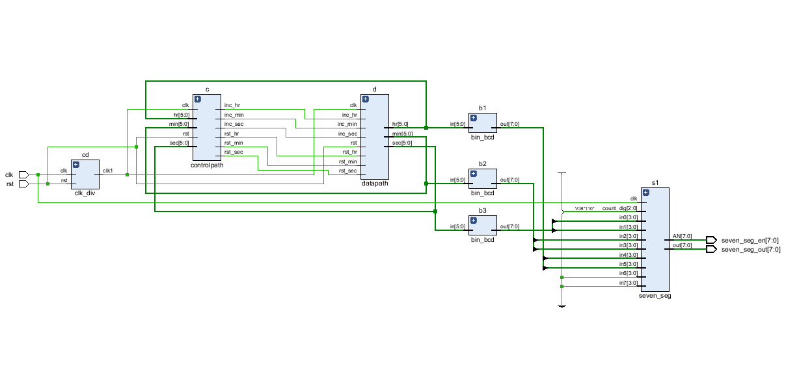

# Digital-Clock-on-FPGA

# 🕒 Digital Clock on FPGA (Datapath + Control Path)

## 📘 Overview
This project implements a **Digital Clock on FPGA** using a **modular Datapath and Control Path** design approach.  
The clock displays **Hours, Minutes, and Seconds**, with functionalities for **Set**, **Adjust**, and **Run** modes.  
It has been **simulated, synthesized, and tested on FPGA hardware**.

---

## ⚙️ Design Highlights

- Separation of **Datapath** (operations, counters, registers) and **Control Path** (FSM, enable signals)
- **Real-time clock** counting in HH:MM:SS
- **Push-button inputs** for mode switching and increment
- **Debouncing logic** for stable user input
- **BCD conversion** for seven-segment display
- **Fully synthesizable Verilog HDL**
- Verified on simulation tools (Xlinx Vivado) and implemented on FPGA (Artrix 7)

---

## 🧠 Architecture & Schematic

### 🔹 Architecture
The **Datapath** includes:
- Second, minute, and hour counters  
- BCD converter and multiplexer for display  
- Display driver and registers  

The **Control Path** is an FSM that:
- Handles mode switching (Run / Set / Adjust)  
- Generates enable signals for each counter  
- Manages button debouncing and control pulses  

**Block Diagram:**  

**Schematic:**  

---

## 🧪 Simulation Results

### Functional Simulation
- Tool used: *ModelSim / Vivado Simulator*  
- Inputs: Clock, Reset, Mode, Increment  
- Output: Time updates in HH:MM:SS format

**Sample Waveform:**  

---

## 💡 FPGA Implementation

- Toolchain: *Xilinx Vivado*  
- Device: Artrix-7 
- Display: *six 7-segment LEDs*  
- Clock Source: *100 MHz onboard oscillator (divided internally)*

**Real Hardware Output:**  

The bitstream was successfully generated and downloaded to FPGA.  
The 7-segment display updates each second and supports *resetting* via buttons.

---

## 🛠️ How to Run

### Simulation

### Synthesis & Implementation (Vivado)

- read_verilog rtl/*.v
- read_xdc constraints/board_example.xdc
- synth_design -top top -part xc7a35ticsg324-1L
- opt_design
- place_design
- route_design
- write_bitstream -force results/digital_clock.bit

### Program FPGA

- open_hw
- connect_hw_server
- open_hw_target
- program_hw_devices

---

## 📊 Results Summary
| Parameter | Description |
|------------|-------------|
| Clock Frequency | 100 MHz |
| Logic Utilization | ~3% (depends on FPGA) |
| Power Consumption | Minimal |
| Simulation Time | 60 seconds |
| Operating Modes | Run / Set / Adjust |
| Verified On | Vivado / Artrix-7 FPGA Board |

---

---

